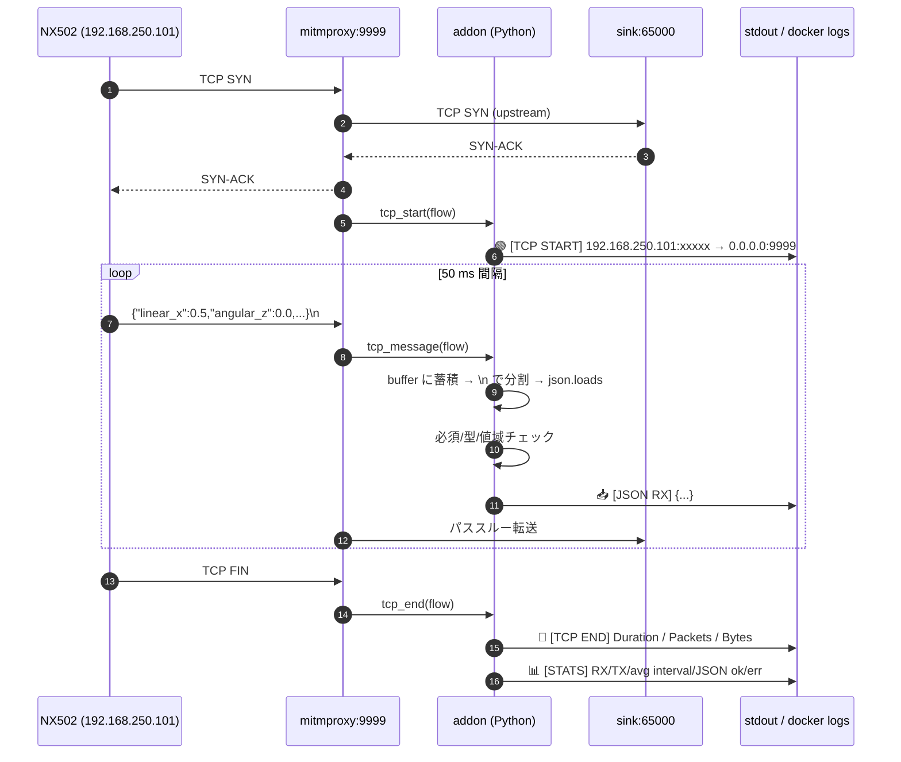
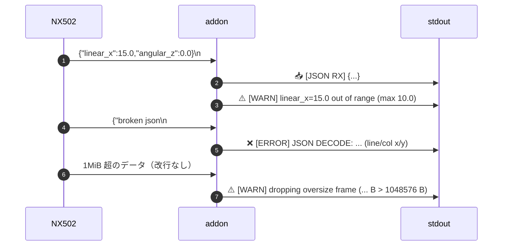
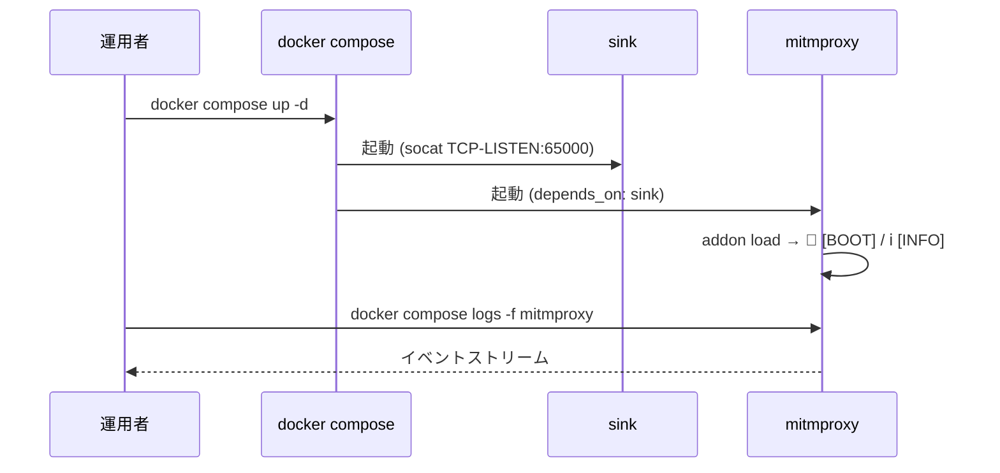

# NX502 ← mitmproxy TCP 監視システム

NX502 コントローラから送信される TCP/JSON ペイロードを **mitmproxy 11.0** で
リアルタイムに観測・検証するための Docker Compose 一式です。改行区切り
JSON フレームをパースして `linear_x` / `angular_z` のスキーマ・値域を
チェックし、接続単位で統計（パケット数、平均間隔、各種エラー数）を集計
します。

NX502 を実機接続するシナリオでも、QEMU ゲスト（Wind River Linux）から
模擬データを流すシナリオでも、同じ構成・同じログ形式で動作します。

---

## 主な機能

- **TCP リバースプロキシモード**で 9999/tcp を受け付け、`socat` sink を
  アップストリームに置くことで純粋な「監視点」として動作
- **改行区切り JSON** のフレーミング・パース・スキーマ検証
- **値域検証**: `linear_x ∈ [-10, 10]`, `angular_z ∈ [-3.15, 3.15]`
- **接続統計**: RX/TX パケット数・バイト数、RX 平均間隔（期待値 50 ms と比較）、
  JSON エラー / スキーマ違反 / 値域違反 / オーバーサイズ破棄 カウント
- **DoS 耐性**: 1 行 1 MiB を超える未終端フレームは破棄し WARN ログ
- **送信元 IP 検証**: 期待外の peer から接続があったら WARN
- **ゲスト側スモークテスト**: BusyBox 安全な疎通スクリプトを同梱

---

## アーキテクチャ

```
                          ┌──────────────────────────────────────┐
                          │ Docker host (Ubuntu 24.04 / WSL2)    │
                          │                                      │
   ┌──────────────┐       │  ┌────────────────┐  ┌────────────┐  │
   │ NX502 /      │ TCP   │  │ mitmproxy 11.0 │  │ socat sink │  │
   │ QEMU guest   │──────►│  │  :9999         │─►│  :65000    │  │
   │ 192.168.250. │ 9999  │  │  + addon       │  │  /dev/null │  │
   │ 101          │       │  └────────────────┘  └────────────┘  │
   └──────────────┘       │  nx502-net (172.28.0.0/24)           │
                          │                                      │
                          └──────────────────────────────────────┘
                                       │
                                       ▼ stdout (docker logs)
                                  運用者 / 監視端末
```

| コンポーネント | 役割 |
|---|---|
| `mitmproxy` | TCP リスナー、フックでフロー監視、JSON 検証、ログ出力 |
| `sink` (`alpine/socat`) | mitmproxy reverse-tcp の終端。受信したバイトを `/dev/null` に捨てるだけ |
| `addon/mitmproxy_addon.py` | mitmproxy のフック実装（Python） |

---

## シーケンス図

### 通常フロー（接続〜JSON 受信〜切断）



### 異常系（不正値・JSON 破損・未終端フレーム）



### 起動・初期化



---

## 必要なもの

| ソフトウェア | バージョン | 備考 |
|---|---|---|
| Docker Engine | 24+ | Compose V2 同梱 |
| Docker Compose | V2 | `docker compose ...` の形式で利用 |
| OS | Ubuntu 24.04 / WSL2 / その他 Linux | mitmproxy / socat はコンテナ提供のためホスト側依存無し |

ネットワーク要件:

- ホストの `9999/tcp` を NX502 (またはゲスト) から到達できること
- 既定ではホストは `192.168.250.100`、ゲストは `192.168.250.101` を想定
  （`.env` で変更可能）

---

## 初期設定

### 1. リポジトリ取得

```bash
git clone https://github.com/taku0310/socket-mitmproxy.git
cd socket-mitmproxy
```

### 2. 環境変数テンプレートをコピー

```bash
cp .env.example .env
```

### 3. `.env` を環境に合わせて編集

```ini
HOST_IP=192.168.250.100         # ホストマシンの IP
GUEST_IP=192.168.250.101        # NX502 / ゲストの IP（送信元検証に使用）
MITM_LISTEN_HOST=0.0.0.0        # 0.0.0.0 で全 IF、絞るなら HOST_IP
MITM_LISTEN_PORT=9999           # NX502 接続先ポート
TZ=Asia/Tokyo
```

オプション（必要時のみ）:

```ini
MAX_LINE_BYTES=1048576          # 未終端フレーム破棄の閾値 (B)
EXPECTED_INTERVAL_MS=50         # 期待される RX 間隔 (ms)
```

### 4. 起動と動作確認

```bash
docker compose up -d
docker compose logs -f mitmproxy
```

起動直後に以下が出れば成功:

```
[YYYY-MM-DD HH:MM:SS.mmm] 🚀 [BOOT] NX502 mitmproxy monitor loaded
[YYYY-MM-DD HH:MM:SS.mmm] ℹ️  [INFO] listen=0.0.0.0:9999 required=['linear_x', 'angular_z'] ...
```

### 5. 疎通テスト（ホスト側からの簡易確認）

```bash
printf '{"linear_x":0.5,"angular_z":0.0,"timestamp":0}\n' \
  | nc 127.0.0.1 9999
```

mitmproxy のログに `🟢 [TCP START]` → `📥 [JSON RX]` → `🔴 [TCP END]`
→ `📊 [STATS]` が出力されれば配線 OK。

### 6. 疎通テスト（QEMU ゲスト側から）

ゲスト側に `test_connectivity.sh` を転送して実行:

```bash
scp test_connectivity.sh root@192.168.250.101:/tmp/
ssh root@192.168.250.101 'bash /tmp/test_connectivity.sh 192.168.250.100 9999'
```

5 項目すべて `[✓]` で完了すれば本番接続可能です。

---

## 運用中の操作

### ログ確認

| 操作 | コマンド |
|---|---|
| ストリーム表示 | `docker compose logs -f mitmproxy` |
| 直近 200 行 | `docker compose logs --tail 200 mitmproxy` |
| WARN/ERROR のみ | `docker compose logs mitmproxy 2>&1 \| grep -E '\[WARN\]\|\[ERROR\]'` |
| 統計のみ抽出 | `docker compose logs mitmproxy 2>&1 \| grep '\[STATS\]'` |
| sink のログ | `docker compose logs sink` |

### 設定変更の反映

`.env` を編集したあとに環境変数の再読込が必要です:

```bash
docker compose up -d           # 変更分だけ再作成される
```

アドオン（`addon/mitmproxy_addon.py`）を編集したとき:

```bash
docker compose restart mitmproxy
```

> アドオンはコンテナにマウントされていますが、mitmproxy はファイル変更を
> 自動再ロードしないため明示的な restart が必要です。

### コンテナ状態確認

```bash
docker compose ps                       # 起動状態
docker compose top mitmproxy            # プロセスツリー
docker stats nx502-mitmproxy            # CPU/メモリ
```

### 停止 / 再起動 / 完全クリーンアップ

```bash
docker compose stop                     # 停止のみ（再開時に状態維持）
docker compose restart mitmproxy        # mitmproxy のみ再起動
docker compose down                     # 停止 & コンテナ削除
docker compose down -v                  # 上に加えてボリュームも削除
```

### 動作中の疎通確認

```bash
# TCP ポートが開いているか（ホストから）
nc -zv 127.0.0.1 9999

# 任意のフレームを送って観測
echo '{"linear_x":1.5,"angular_z":0.5,"timestamp":0}' | nc 127.0.0.1 9999

# 値域外を意図的に流してアラートを確認
echo '{"linear_x":99.9,"angular_z":0.0}' | nc 127.0.0.1 9999

# JSON 破損を意図的に流してエラーを確認
echo 'not a json' | nc 127.0.0.1 9999
```

---

## ログフォーマット

すべて stdout に `[YYYY-MM-DD HH:MM:SS.mmm] アイコン [ラベル] 内容` 形式で
出力されます。

| アイコン | ラベル | 意味 |
|---|---|---|
| 🚀 | `BOOT` | アドオン読み込み完了 |
| ℹ️ | `INFO` | 起動時の設定値表示 |
| 🟢 | `TCP START` | TCP 接続確立。`src_ip:port → bind_host:bind_port` |
| 📥 | `JSON RX` | クライアントから受信した 1 行 JSON の全文 |
| ⚠️ | `WARN` | スキーマ違反 / 値域逸脱 / 未終端フレーム破棄など |
| ❌ | `ERROR` | JSON デコード失敗 / TCP エラー |
| 🔴 | `TCP END` | 接続終了。`Duration / Packets / Bytes` |
| 📊 | `STATS` | 接続単位サマリ（RX/TX、avg interval、エラー数） |

---

## コマンドリファレンス

### Docker Compose

| 目的 | コマンド |
|---|---|
| 起動 | `docker compose up -d` |
| 停止 | `docker compose stop` |
| 削除 | `docker compose down` |
| 再起動 | `docker compose restart [service]` |
| ログ追跡 | `docker compose logs -f [service]` |
| 設定検証 | `docker compose config` |
| 状態 | `docker compose ps` |
| 個別実行 | `docker compose exec mitmproxy sh` |

### 疎通テスト（ゲスト側）

```bash
bash test_connectivity.sh                              # デフォルト 192.168.1.100:9999
bash test_connectivity.sh 192.168.250.100 9999         # 本構成
bash test_connectivity.sh 192.168.250.100 9999 > log   # 結果をファイル保存
```

### Git

| 目的 | コマンド |
|---|---|
| クローン | `git clone https://github.com/taku0310/socket-mitmproxy.git` |
| 更新取得 | `git pull origin main` |

---

## ディレクトリ構成

```
.
├── README.md                  # このファイル
├── docker-compose.yml         # mitmproxy + sink + bridge ネットワーク
├── .env.example               # 環境変数テンプレ
├── .gitignore
├── addon/
│   └── mitmproxy_addon.py     # mitmproxy のフック実装（Python）
└── test_connectivity.sh       # QEMU ゲスト用疎通テスト
```

---

## トラブルシューティング

### Q. `docker compose up -d` 直後に mitmproxy が落ちる
- `docker compose logs mitmproxy` でエラー確認
- `sink` が立ち上がる前に mitmproxy が起動すると `upstream connection failed` で
  終了することあり。`docker compose up -d sink && sleep 2 && docker compose up -d mitmproxy` で順序起動

### Q. NX502 から接続しているのに `🟢 [TCP START]` が出ない
1. ホスト側ファイアウォール確認:
   ```bash
   sudo ufw status
   sudo ufw allow 9999/tcp
   ```
2. ホストからは見えるか:
   ```bash
   nc -zv 127.0.0.1 9999
   ```
3. ゲストからホストへの ICMP / TCP 到達性をテストスクリプトで確認:
   ```bash
   bash test_connectivity.sh 192.168.250.100 9999
   ```

### Q. `⚠️ [WARN] dropping oversize frame` が出る
- NX502 が改行を入れずに長大データを送っている可能性
- 一時的に `MAX_LINE_BYTES` を増やして観測:
  ```ini
  MAX_LINE_BYTES=4194304
  ```
- 根本対応: 送信側プロトコルに `\n` 終端を追加

### Q. `avg RX interval` が期待値（50 ms）と大きく乖離している
- `📊 [STATS]` の `RX pkts` が極端に少ない場合は計測サンプル不足
- 期待値そのものを `.env` で調整:
  ```ini
  EXPECTED_INTERVAL_MS=100
  ```

### Q. `⚠️ [WARN] unexpected source IP` が出る
- NX502 と異なるホストから接続が来ている
- 期待値を上書き or 無効化:
  ```ini
  GUEST_IP=                # 空にすると検証スキップ
  ```

### Q. ログにペイロード全文が出るのが気になる（PII 等）
- `--flow-detail` を下げる（`docker-compose.yml` の `command`）
- アドオン側の `_log(f"[{_ts()}] 📥 [JSON RX] {text}")` を hash 表示に書き換え

---

## ライセンス / 利用範囲

このリポジトリは NX502 の挙動検証 / プロトコル監査 / 開発時テストでの利用を
想定しています。本番ネットワーク上で常時走らせる場合は、ペイロードが平文で
ログ出力される点・ホスト 0.0.0.0:9999 が公開される点を踏まえて、`.env` の
`MITM_LISTEN_HOST` を NX502 セグメント専用 IP に絞ることを推奨します。
